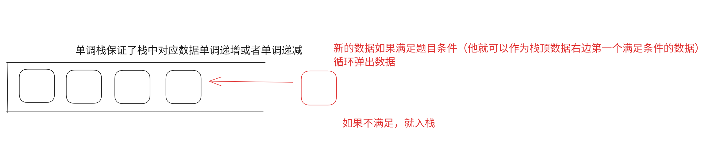

# 这里主要记录的我学算法的路线以及一些心得体会

> create by hrj on 4.23 2025
---

## 我的刷题格式

    部分题目我可能会在其中写出很详细的思路,一般是一种类型的题目为单位

## 1.双指针 && 滑动窗口

    滑动窗口其实本质上也算一种双指针
    双指针一般情况下,在我们遍历数组的过程中,有些时候我们可以减伤很多不必要的遍历
    比如类似于三数之和的,很多时候,我们可以通过对数组进行排序使得我们进行很多算法的过程中

    template <滑动窗口>//这里我特化一下滑动窗口
    1.进入窗口
    2.检查窗口中数据的合理性
        出窗口
    3.更新结果

## 2.二分查找

    二分查找并不是局限于在一个数组中找到某个数字
    二分查找的精髓是,当我们能够通过某种方式将一个数组分成两个部分,我们都可以通过二分的方式分厂轻松的
    找到他们的分界点
    细节   1.mid = left + (right - left) / 2
          2.mid = left + (right - left + 1) / 2
          这里一个是寻找分界线左边的节点,一个是寻找分界线右边的节点

## 3.前缀和

    前缀和其实算是一种动态规划吧,前缀和的本质其实方便我们很快速的来进行数组中的 求和
    我们可以通过牺牲内存的方式来建立前缀和数组,这样,我们的数组中所有元素的求和会变得十分的简单
    有些时候我们习惯于将前缀同hashtable相联系

## 4.位运算

    1.基础位运算
        << >> ~
        & | ^无进位相加
    2.判断一个数的第x位是0还是1
        n = (n >> x) if(n & 1) cout << true; else cout << false;
    3.将第x位修改成1
        tmp = 1; tmp << x ; n | x 成立
    4.第x位修改成0
        tmp = 1; tmp << x; tmp ~= tmp;
    5.提取一个数的最右侧的1
        方法:lowbit n & (-n)这里面设计了一些补码的基本知识,将最右侧的一提取出来
        lowbe法
    6.干掉一个数最右侧的1
        n & (n - 1)
        //5.6两种方案确实很巧妙,这里建议的是记住他们的方式
    7.位运算优先级
        加括号
    8.异或运算

## 5.模拟

## 6.分治

    快速排序 : 三路划分 + 等概率取得keyi元素

## 7.哈希算法

    哈希算法的本质是将一个值映射到一个固定大小的数组中,然后通过这个数组来进行查找   
        常见的哈希算法有:
            散列函数: 直接定址法,数字分析法,平方取中,除留余数,折叠法,随机数法
            冲突处理: 开放寻址法,再散列法,链地址法,建立公共溢出区,建立公共溢出表,建立公共溢出链表
            扩容: 开放寻址法,链地址法,建立公共溢出区,建立公共溢出表,建立公共溢出链表

## dfs

针对dfs的算法，我们需要处理好怎么去进行剪枝以及回溯,我们修改了当前的情况，也同样需要一个相对的函数来进行复原
回溯 -- 恢复现场(这是回溯的关键)

## 记忆化搜索 MemSearch

例题: 斐波那契数列

```cpp
// 常见的递归的时间复杂度是o(2^n)
int fib(n)
{
    if(n == 1 || n == 2) return 1;
    return fib(n) + fib(n - 1);
}

// 记忆化搜索(通过备忘录的方式进行搜索)
// 备忘录可以是数组,也可以是Hash
class Solution {
#define MODNUM 1000000007
    unordered_map<int,int> hash;
public:
    int dfs(int n)
    {
        if(hash.count(n)) return hash[n];
        hash[n] = ((dfs(n - 1) + dfs(n - 2)) % MODNUM);
        return hash[n];
    }
    int fib(int n) {
        hash[0] = 0, hash[1] = 1;
        return dfs(n);
    }
};
// 记忆化搜索 = 带备忘录的递归
```

## 字符串

## 多源的最短路问题

同时将多个源添加队列，并且将这些源点同时干掉

## dp(动态规划)

### 路径问题

路径问题我们经典的思路,dp[i][j]表示从开始的位置到i,j这个为止最大/最小/之和这类的描述题目

### 背包问题

地上一堆物品，如何求出价值最大的放入背包。

我们要考虑物品的属性和背包的属性

||1|2|3|
|---|---|---|----|
|体积|4|5|2|

01背包：每个物品要么不选，要么选 
完全背包：每个物品选择的次数不限

### 多状态问题


# leetcode的学习记录


## 单调栈

单调栈的算法可以帮助我们解决类似数组中每个下标对应元素的右边或者左边的第一个大于或者小于元素对应的位置



典型的题目：

* 每日温度  (leetcode hot 100) ./Stack/dailyTemperatures.h
