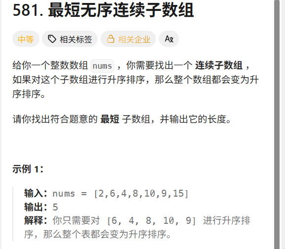

## 第三大的数

leetcode 链接： https://leetcode.cn/problems/third-maximum-number/

问题找到数组中的第三的数，我的第一个思路还是topk问题，就是通过构建一个堆表示当前最大的几个数

时间复杂度 : n * log(k)

思路：

1. 首先将数组的前k个数构建一个小根堆，然后如果新的数，大于堆顶，将堆顶删除，将这个数添加

2. 如果没有，continue

```cpp
class Solution {
public:
    int thirdMax(vector<int>& nums) {
        // 边界判断
        if(nums.size() == 2)
            return std::max(nums[0], nums[1]);
        else if(nums.size() == 1) 
            return nums[0];
        std::priority_queue<int,std::vector<int>,std::greater<int>> pq;// 默认是小根堆
        for(int i = 0;i < 3;i++)
            pq.push(nums[i]);
        
        for(int i = 3;i < nums.size();i++)
        {
            if(nums[i] > pq.top()) 
            {
                pq.pop();
                pq.push(nums[i]);
            }
        }

        return pq.top();
    }
};
```
这是我第一次写的，显然出现了一个问题，就是审题不清晰，这道题还需要我们进行数据的去重，就是同样的数据不能计算两次。

解决方式就是通过hash表进行去重，但是这样可能造成o(n)的空间复杂度的浪费，这里我们不推荐

**所以换一种思路**

因为三很小，我们直接通过设计三个常量来进行表示

```cpp
class Solution {
public:
    int thirdMax(vector<int>& nums) {
        
        long long firs = LONG_MIN, secon = LONG_MIN, thir = LONG_MIN;

        for(int i = 0;i < nums.size();i++)
        {
            int x = nums[i];
            if(x > firs && x < secon)
                firs = x;
            else if(x > secon && x < thir)
            {
                firs = secon;
                secon = x;
            }
            else if(x > thir)
            {
                firs = secon;
                secon = thir;
                thir = x;
            }
        }
        //
        if(firs != LONG_MIN) return firs;
        else return std::max(secon, thir);
    }
};
```

## 最短无序连续数组, 经典

leetcode : https://leetcode.cn/problems/shortest-unsorted-continuous-subarray/



我直接看到这道题目的一路就是将排好序的数组和这道题目直接对比，对比出的第一个不同的位置和最后一个不同位置的差 + 1就是答案

```cpp
class Solution {
public:
    int findUnsortedSubarray(vector<int>& nums) {

        std::vector<int> copy_nums;
        std::copy(nums.begin(),nums.end(),std::back_inserter(copy_nums));
        std::sort(copy_nums.begin(), copy_nums.end());
        // 找到开始不同的位置
        
        for(auto e : copy_nums) std::cout << e << " ";
        
        std::cout << std::endl;
        int n = nums.size();
        int i = 0;
        for(i = 0;i < n;i++)
        {
            if(copy_nums[i] != nums[i]) break;
        }
        // 
        if(i == n) return 0; // 完全相同

        // 从后往前找

        int j = 0;
        for(j = n - 1;j >= i;j--)
            if(copy_nums[j] != nums[j]) break;
        
        
        return  j - i + 1;
    }
};

```

但是呢，他有希望你是否能够给出一个o(n)时间复杂度的算法，上面算法中利用了std::sort, 他的底层快速排序为n * log(n), 所以现在我们思考如何才能对其进行优化呢？


优化思路： 

什么样的部分我们需要重拍，当前位置前面存在一个比我还大的数，比如[1 3 5 4]

4这个位置现任是错的，因为他的前面有一个5, 从左遍历可以帮助我们找到无序列表的最右端，对吧，

因为我们找到4是错的，但是不能判断5是错的，当我们再次从右向左进行遍历的时候，发现我的后面有

一个比我小的数，就把5找到了。

```cpp
class Solution {
public:
    int findUnsortedSubarray(vector<int>& nums) {
        
        // 从左往右找找到右边界

        int Max = -INT32_MAX;
        int left_edge = 0, right_edge = 0;

        // 右边界
        for(int i = 0;i < nums.size();i++)
        {
            if(Max > nums[i]) right_edge = i;
            else Max = nums[i];
        }
        //左边界
        int Min = INT32_MAX;
        for(int i = nums.size() - 1;i >= 0;i--)
        {
            if(Min < nums[i]) left_edge = i;
            else Min = nums[i]; 
        }

        return left_edge == right_edge ? 0 : right_edge - left_edge + 1;
    }
};
```

总结： 这道题目我们需要定位出矛盾，什么样的位置需要排列，某个位置存在大于我们的数， 或者某个位置后存在小于我们的数，都是矛盾，通过两次o(n)的循环找到矛盾即可。


