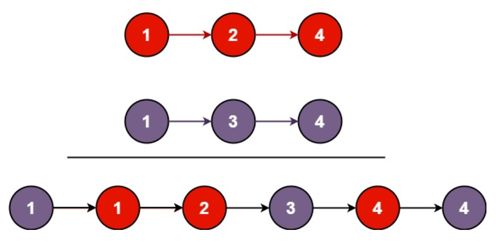

# 链表章节

## 合并两个有序链表

将两个升序链表合并为一个新的 升序 链表并返回。新链表是通过拼接给定的两个链表的所有节点组成的。 

 



**思路**

简单的链表题目

```cpp
class Solution {
public:
    class List
    {
    public:
        void append(ListNode* newnode)
        {
            if(!head_) head_ = tail_ = newnode;
            else
            {
                tail_->next = newnode;
                tail_ = newnode;
                newnode->next = nullptr;
            }
        }

        ListNode* getHeadPtr() { return head_; }
    private:
        ListNode* head_ = nullptr;
        ListNode* tail_ = nullptr;
    };

    ListNode* mergeTwoLists(ListNode* list1, ListNode* list2) {
        ListNode* l = list1, *r = list2;
        List lst;   
        while(l || r)
        {
            ListNode* newnode = nullptr;
            if(!l) 
            {
                newnode = r;
                r = r->next;
            } else if(!r)
            {
                newnode = l;
                l = l->next;
            } else if(l->val > r->val)
            {
                newnode = r;
                r = r->next;
            } else 
            {
                newnode = l;
                l = l->next; 
            }
            lst.append(newnode);
        }

        return lst.getHeadPtr();
    }
};
```

## 反转链表

给你单链表的头节点 head ，请你反转链表，并返回反转后的链表。
 
```cpp
class Solution {
public:
    class List
    {
    public:
        void appendFront(ListNode* newnode)
        {
            if(!head_) 
            {
                head_ = newnode;
                head_->next = nullptr;
            }
            else 
            {
                newnode->next = head_;
                head_= newnode;
            }
        }
        ListNode* getHead() { return head_; }
    private:
        ListNode* head_ = nullptr;
    };
    ListNode* reverseList(ListNode* head) 
    {
        List lst;
        ListNode* cur = head;
        while(cur != nullptr)
        {
            ListNode* tmp = cur->next;
            lst.appendFront(cur);
            cur = tmp;
        }    
        return lst.getHead();
    }
};
```

## 删除链表中的节点

有一个单链表的 head，我们想删除它其中的一个节点 node。

给你一个需要删除的节点 node 。你将 无法访问 第一个节点  head。

链表的所有值都是 唯一的，并且保证给定的节点 node 不是链表中的最后一个节点。

删除给定的节点。注意，删除节点并不是指从内存中删除它。这里的意思是：

给定节点的值不应该存在于链表中。
链表中的节点数应该减少 1。
node 前面的所有值顺序相同。
node 后面的所有值顺序相同。


```cpp

```